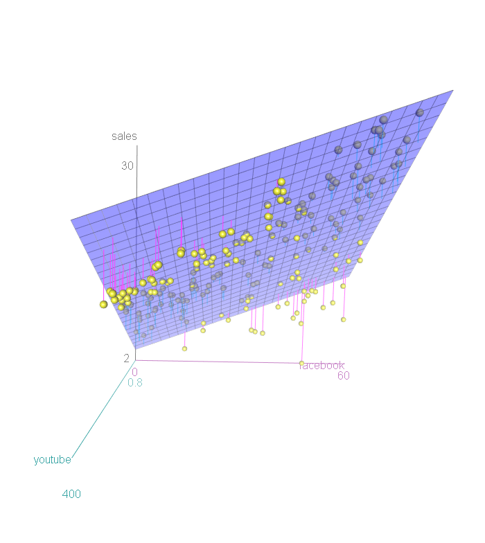
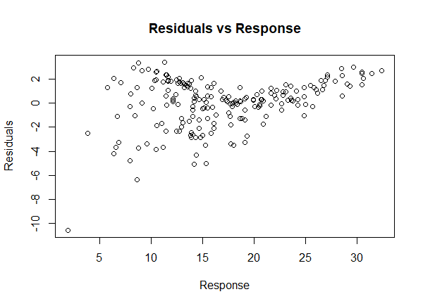
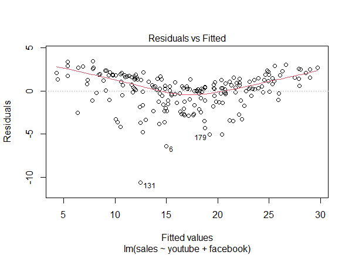
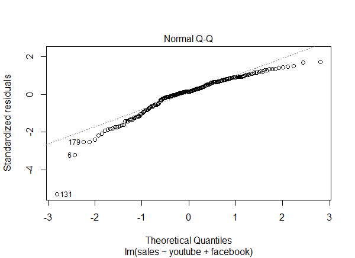

```{r setup, include=FALSE}
knitr::opts_chunk$set(echo = TRUE)
```
```{r echo=FALSE, include=FALSE}
library(car)
library(rgl)
library(datarium)
marketingLib <- datarium::marketing
library(ggiraph)
library(ggiraphExtra)
library(plyr)
library(gvlma)
library(trafo)
```

#  Regression analysis
\
\

\
\

# Introduction

The marketingLib dataset contains the impact of three advertising medias
(youtube, facebook and newspaper) on sales. Data are the advertising budget
in thousands of dollars along with the sales (in thousands of units). The
advertising experiment has been repeated 200 times. This is a simulated data. The aim of this paper is to perform regression analysis on the data from the given dataset.

# Data summary

```{r}
head(marketingLib)
```
Note that ***marketingLib*** is a dataset from the **datarium** package, whereas ***marketing*** contains is a custom dataset which contains no outliers.

# Dependency assumption
```{r}
pairs(~sales+youtube+facebook+newspaper, data=marketingLib)
```

Recall the classical regression model definition

$$
\begin{aligned}\large
y=f(\vec{\beta}, x^{(1)},..,x^{(m)})+\varepsilon
\end{aligned}
$$

where $f(•)$ is an unknown regression function, $y$ are the observations of the response-vector variable, $X=(x^{(1)},..,x^{(m)})$ - matrix of observations of the independent variables(regressors). \varepsilon denotes a random error of the regression. It is believed, the error variable is independent from from the regressor observations and has a zero mean.

There are three regressors in our case: youtube, facebook, newspaper. The dependent variable is **sales**. The scatterplot above gives an insight about the type of functional dependency between the variables. Visual analysis suggests a vivid relationship(linear?) between sales and youtube as well as between sales and facebook, though it seems to be less determined.

# Regression model parameters
```{r}
model<-lm(sales ~ youtube+facebook+newspaper,data = marketingLib)
summary(model)
confint(model)
```

Range and quartile data on residuals is used to determine, whether the residual random variable is normally distributed or not. As the data is simulated, the mean of the observations is 0, but the median differs from zero quite sufficiently.
Coefficients sections contains information about the unknown parameters and provides critera statistics as well. The Intercept is $\vec{\beta_0}$. The Estimate column shows the beta estimator values, computed using the residual sum of squares method. Standard error is defined as standard deviation divided by the square root of the sample size. t-statistic is used to test the hypothesis of the form $H_0:\beta=\beta_0$ and the default value of $\beta_0$ is assumed to be 0. If the corresponding p=value is significant, the estimate of the corresponding unknown parameter is close to 0 and should not be included into the model.
The residual standard error is the square root of the residual sum of squares divided by the residual degrees of freedom, that is 200-4=196. Given the RSE, confidence intervals can be calculated.

# Model correction

Due to insignificance of the "newspaper" regressor, it should be excluded from the model to make it fit the response better. The model's paramters are in this way:

```{r}
model<-lm(sales ~ youtube+facebook,data = marketingLib)
summary(model)
confint(model)
```

The F-statistic has risen which means the regressors have more influence on the estimate and make it either more or less accurate, but it should first be proved.

## Fitted plane

Since the model includes two independent variables and one dependent, a 3D scatterplot could more or less precisely indicate the type of functional dependency between the variables.

```{r, echo=FALSE}
scatter3d(sales~facebook * youtube, data=marketingLib)
```


## Fitted lines

Having fixed one variable in a three-dimensional space, one can project the line onto two-dimensional basis.

### youtube given facebook

```{r, echo=FALSE}
ggPredict(model,se=TRUE,interactive=TRUE)
```

### facebook given youtube

```{r}
model<-lm(sales ~ facebook+youtube,data = marketingLib)
ggPredict(model,se=TRUE,interactive=TRUE)

```

Visual comparison of the two above plots helps outline an important point on the variables' deviance: they both have high level of homoscedasticity, and combined with each other produce non-optimal fitted estimate of the response.

# Residuals assessment

The quality of the model is highly dependent on the residuals scale and distribution. For these reason, their assessment is crucial for further model evaluation.










# Gauss-Markov assumptions

The Gauss–Markov theorem states that the ordinary least squares (OLS) estimator has the lowest sampling variance within the class of linear unbiased estimators, if the errors in the linear regression model are uncorrelated, have equal variances and expectation value of zero.

The Gauss–Markov assumptions concern the set of error random variables, ${\displaystyle \varepsilon _{i}}$:

• They have mean zero: ${\displaystyle \operatorname {E} [\varepsilon _{i}]=0.}$ \
• They are homoscedastic, that is all have the same finite variance: ${\displaystyle \operatorname {Var} (\varepsilon _{i})=\sigma ^{2}<\infty }$ and \
• Distinct error terms are uncorrelated: ${\displaystyle {\text{Cov}}(\varepsilon _{i},\varepsilon _{j})=0,\forall i\neq j}$ \

The ordinary least squares estimator (OLS) is the function
$$
\begin{aligned}\large
{\displaystyle {\widehat {\beta }}=(X'X)^{-1}X'y}
\end{aligned}
$$

that minimizes the sum of squares of residuals 

$$
\begin{aligned}\large
{\displaystyle \sum _{i=1}^{n}\left(y_{i}-{\widehat {y}}_{i}\right)^{2}=\sum _{i=1}^{n}\left(y_{i}-\sum _{j=1}^{K}{\widehat {\beta }}_{j}X_{ij}\right)^{2}.}
\end{aligned}
$$  

The theorem states that the OLS estimator is the best linear estimator. The main idea of the proof is that the least-squares estimator is uncorrelated with every linear unbiased estimator of zero, i.e., with every linear combination ${\displaystyle a_{1}y_{1}+\cdots +a_{n}y_{n}}a_{1}y_{1}+\cdots +a_{n}y_{n}$ whose coefficients do not depend upon the unobservable ${\displaystyle \beta }\beta $ but whose expected value is always zero.

## Check the estimator

```{r}
model<-lm(sales ~ youtube+facebook,data = marketingLib)
gvlma(model)
```

### Heteroscedasticity
When residuals do not have constant variance (they exhibit heteroscedasticity), it is difficult to determine the true standard deviation of the forecast errors, usually resulting in confidence intervals that are too wide/narrow. The p-value in this case is significant and we therefore conclude the data has non-monotonous variance.

### Link function

Link Function specifies the link between random and systematic components. It says how the expected value of the response relates to the linear predictor of explanatory variables; e.g., η = g(E(Yi)) = E(Yi). Low p-value implies low strength of the relationship.

### Global Stat

Global stat tests null hypothesis that the model is a linear combination of the predictors.

# Tuning

The model is by far not flowless, because the residuals observations contain outliers and the formula of the estimate function includes the *facebook* variable which adds additional noise and affects the RSS. For this reason, it should be excluded from the model.

```{r}
model2<-lm(sales ~ youtube,data = marketing)

```

## Residual outliers detection
There were a few heavy outliers in the initial dataset given the initial estimate function parameters.

```{r}
model<-lm(sales ~ youtube+facebook,data = marketingLib)
boxplot(model$residuals)

```

A single regressor and a clean dataset promises a more precise model.

```{r}
boxplot(model2$residuals)
```

## Adjusted parameters
```{r}
summary(model2)
confint(model2)
plot(marketing$sales, model2$residuals, ylab = "Residuals", xlab = "Response", main = "Residuals vs Response")

```
The RSE has risen from 2.023 to 3.91 due to smaller amount of observations and therefore decreased number of degrees of freedom. The multiple and adjusted R-squared have though become significantly closer to zero, which means greater accuracy of the fitted values. Due to loss of the *facebook* regressor, the F-statistic has vividly dropped as well.


```{r}
plot(model2)
```
The normal Q-Q plot helps estimate "normality" of the residuals' distribution. In this case, the tails are somewhat heavier than in the normal distribution. 
The “Cook’s distance” dashed curves don’t even appear on the Residuals vs Leverage plot. None of the points come close to having both high residual and leverage. Each point is therefore well approximated by the model.

## Evaluate model

```{r}
gvlma(model2)
```

It shall now be proved, that the model provides the best fit using the *trafo* package.

```{r, echo=FALSE}
linMod_trafo2 <- trafo_lm(object = model2, trafo = "logshiftopt", method = "skew")
plot(linMod_trafo2)

```

# Non-linear transformation

Exploratory analysis suggests, there is a semi-linear relationship between sales and youtube, but what if it is quadratic? The anova() function performs a hypothesis test comparing the two models - linear and quadratic:
```{r}
fit1<-lm(sales ~ youtube,data = marketing)
fit2<-lm(sales ~ youtube+I(youtube^2),data = marketing)
anova(fit1 ,fit2)
```

Here Model 1 represents the linear submodel containing only one predictor, youtube, while Model 2 corresponds to the larger quadratic model that has two predictors, youtube and youtube^2. The null hypothesis is that the two models fit the data equally well, and the alternative hypothesis is that the full model is superior. Significant p-value suggests the models do not differ much. Indeed, the Response vs Residuals plot would have a similar pattern to the previous one.

# Log-shift transformation

Transformations have the potential to correct certain violations of model assumptions and by
doing so, allow an analysis to continue with the linear regression model. The point is, relationship between sales and youtube is in fact not linear, but rather logarithmic. Logging of the estimate however does not satisfy the Gauss-Markov theorem assumptions.

```{r}
gvlma(lm(log(sales) ~ youtube,data = marketing))
```

But what prevents the model to be just right in case of the given dataset? It turns out that the logarithm estimate function has to be adjusted by a certain parameter that would minimize divergence from the model, suggested by the trafo package.

```{r}
model2<-lm(sales ~ youtube,data = marketing)
x<-logshiftopt(object = model2, method = "div.ks", plotit = TRUE)
x$lambdavector[x$measvector == x$measoptim]
```

So, the optimal lambda is roughly 23. The model becomes the following:

```{r}
fit2<-lm(log(sales+23) ~ I(poly(youtube,6)),data = marketing)
gvlma(fit2)
```

Interestingly, the more superior fit2 model satisfies the Gauss-Markov assumptions and is therefore preferable, though anova analysis implies the models perform only somewhat differently.

The following Response vs Residuals plot shall be compared with the initial one to assess the analysis and model adjustment results.

```{r}
plot(marketing$sales, fit2$residuals, main="Residuals vs Response", xlab = "Response", ylab = "Residuals")
range(fit2$residuals)
```


# Conclusion

The initial linear regression model contained too much noise caused by the *newspaper* variable. Relationship between *facebook* and sales was not clear and could not help optimise the model. However the *youtube* variable had a high correlation rate with the response and had to be more precisely analysed. Logarithmic dependence was obvious from the exploratory analysis phase, though linear relationship could be also possible. Adjustment of the logged response variable resulted into its best estimate, give that the regressor was non-linear(had a power of 6).


